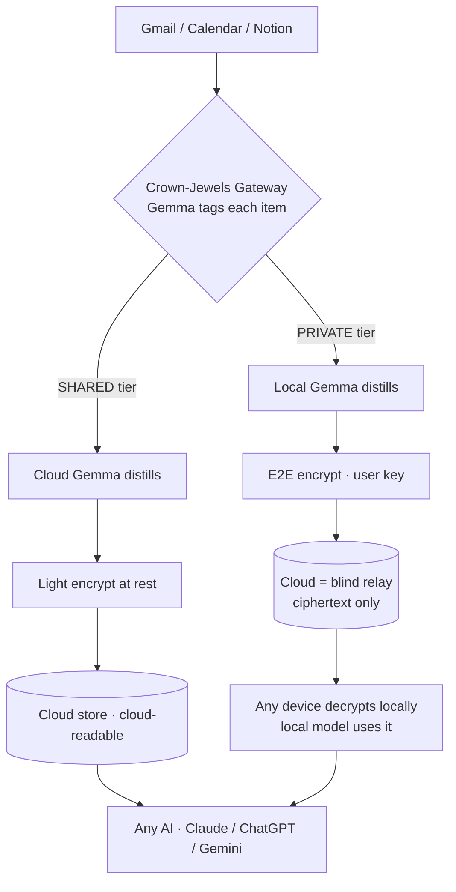

# Contxt — Architecture

## Two-tier context model

## Tier definitions

| Tier | Processing | Storage | Who can read |
| --- | --- | --- | --- |
| **PRIVATE** | Local Gemma on-device | Cloud = ciphertext only (blind relay) | Local model on your device only |
| **SHARED** | Cloud Gemma (Fireworks / AMD) | Cloud store, light encryption at rest | Any AI via MCP |

## Crown-Jewels Gateway

Runs **on-device** — trust boundary. Nothing leaves before this decision.

1. Deterministic rules — force `PRIVATE` for money, card numbers, phone, health, user keywords.
2. Gemma classification — `{tier, sensitivity, categories, reason}` with user toggle policy.

## Encryption

- AES-256-GCM + ECDH (X25519) via Web Crypto API.
- Multi-device: QR code key transfer. Cloud stores ciphertext only.

## Local model

- Gemma 3 270M (Q4) via Transformers.js + WebGPU in MV3 offscreen document.
- Weights cached in OPFS. Fallback: Ollama sidecar.

## Cloud model

- Gemma on Fireworks / AMD Dev Cloud — SHARED tier + `draft_reply`.
- Qualifies for the $2,000 AMD-hosted Gemma prize.

## MCP tools

- `get_context(query)` — SHARED context cards.
- `draft_reply(email)` — one agentic action for the demo.

## Roadmap (out of hackathon scope)

Full local-everything · Sesame key ratcheting · Tauri desktop app · mobile on-device Gemma 3n · fine-tuned 270M classifier.
