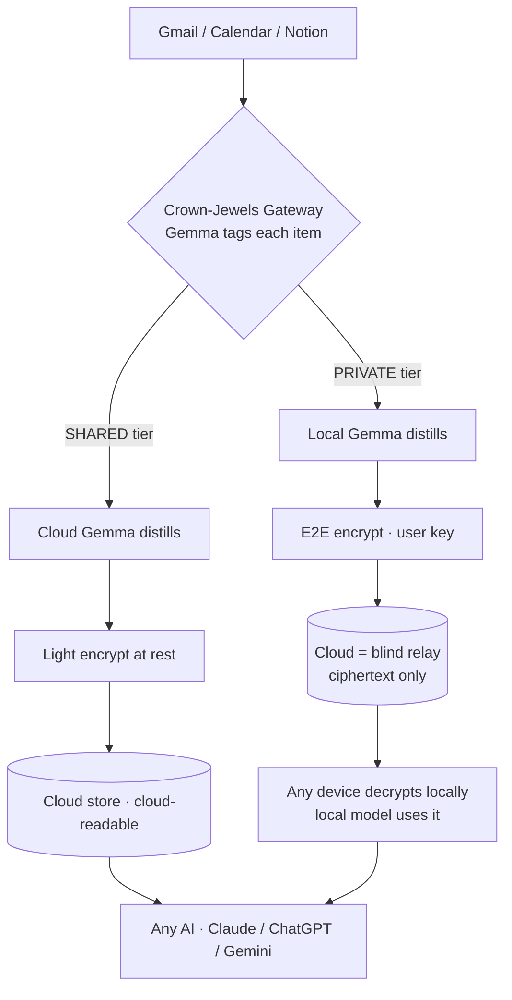
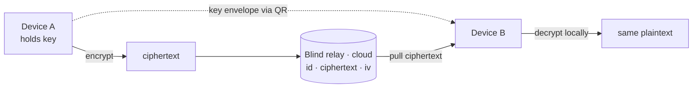
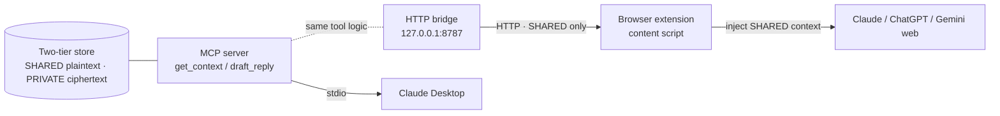

# Contxt — Architecture

## Two-tier context model

## Tier definitions

| Tier | Processing | Storage | Who can read |
| --- | --- | --- | --- |
| **PRIVATE** | Local Gemma on-device | Cloud = ciphertext only (blind relay) | Local model on your device only |
| **SHARED** | Cloud Gemma (Fireworks / AMD) | Cloud store, light encryption at rest | Any AI via MCP |

## Crown-Jewels Gateway

Runs **on-device** — trust boundary. Nothing leaves before this decision.

1. Deterministic rules — force `PRIVATE` for money, card numbers, phone, health, user keywords.
2. Gemma classification — `{tier, sensitivity, categories, reason}` with user toggle policy.

## Encryption

- AES-256-GCM + ECDH (X25519) via Web Crypto API.
- Multi-device: QR code key transfer. Cloud stores ciphertext only.

## Multi-device (CHA-22)

The same encrypted private card decrypts on a second device after a QR key transfer —
proving portability without weakening the zero-knowledge guarantee.

- **Key path (out-of-band):** Device A renders its AES-256-GCM key as a QR *key envelope*
  (`{v, alg, k}`). Device B scans or pastes it. The key travels device-to-device only.
- **Ciphertext path (through the cloud):** the blind relay holds `{id, ciphertext, iv,
  created_at}` and nothing else — there is no key field and key-shaped writes are rejected,
  so "the cloud never held the key" is structural, not a promise.
- **Proof:** ciphertext alone is useless — a device without the transferred key hits
  `InvalidTag`. With the key, Device B recovers Device A's plaintext byte-for-byte.
- Demo: web **Devices** tab. Headless proof: `python3 server/verify_cha22.py`.
- Scope: 2 clients, one blob. No Signal-grade session ratchet (roadmap).

## Local model

- Gemma 3 270M (fp16) via Transformers.js + WebGPU in MV3 offscreen document.
- Weights cached in OPFS. Fallback: Ollama sidecar.

## Cloud model

- Gemma on Fireworks / AMD Dev Cloud — SHARED tier + `draft_reply`.
- Qualifies for the $2,000 AMD-hosted Gemma prize.

## MCP tools

- `get_context(query)` — SHARED context cards.
- `draft_reply(email)` — one agentic action for the demo.

## Serving to the browser — the inject-into-any-AI bridge (CHA-26)

MCP clients (Claude Desktop) reach the tools over **stdio**. A browser extension
cannot speak stdio, so `server/http_bridge.py` fronts the *same* `get_context` /
`draft_reply` functions over local HTTP. One source of truth, two transports.

- The bridge's `/get_context` serves **SHARED cards only** plus a `private_total`
  count. PRIVATE plaintext is never serialized onto the wire — the crown jewels
  cannot leak into a cloud chat, *by construction* (not by promise).
- The content script (`extension/content.js`) detects Claude / ChatGPT / Gemini,
  auto-injects the SHARED cards into the composer, and shows a badge:
  *N shared → this AI · P private kept on-device*. If the bridge is down it falls
  back to a bundled fixture, so the demo always injects something.
- Headless proof (boots the bridge, asserts zero private leakage):
  `python3 server/verify_cha26.py`.

## Roadmap (out of hackathon scope)

Full local-everything · Sesame key ratcheting · Tauri desktop app · mobile on-device Gemma 3n · fine-tuned 270M classifier.
