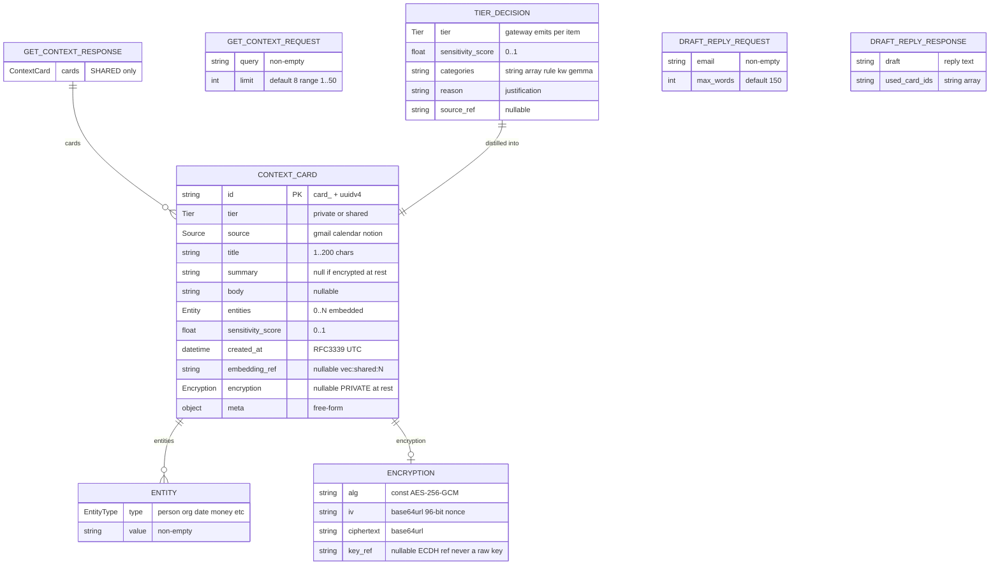
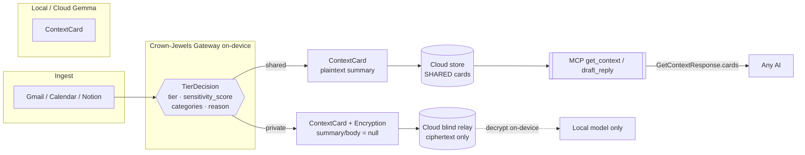

# Contxt — Context-card schema (the shared contract)

The single data contract every piece builds against (**CHA-15**). Canonical source:
[`schema/context_card.schema.json`](../schema/context_card.schema.json); mirrors in
[`schema/types.ts`](../schema/types.ts) (UI) and [`schema/models.py`](../schema/models.py)
(MCP + Gateway); mock data in [`schema/fixtures/`](../schema/fixtures/).

## Data shapes

## Where each shape crosses a boundary

## Design note — parse, don't validate

`tier` has **one** representation: the lowercase strings `"private"` / `"shared"`. The
`Tier` enum's *value* is the wire value, so parsing (raw → `Tier`) and serialization
(`Tier` → JSON) are exact inverses with no transform step. The Gateway boundary parses
once — `Tier._missing_` tolerates model/legacy casing like `"PRIVATE"` but canonicalizes
to the single form — so no code downstream re-checks or re-cases the tier.
(cf. Alexis King, [_Parse, don't validate_](https://lexi-lambda.github.io/blog/2019/11/05/parse-don-t-validate/).)
